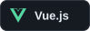
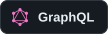
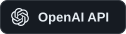

<h1>
  
  
  Renan Mischiatti
  
</h1>

<!-- Conta requisições da imagem, não visitantes únicos. Mesmo contador nas duas versões. -->

  
  <strong>Software Engineer · PHP & Laravel · Backend & Full Stack</strong>

 São José dos Campos, Brasil &nbsp;·&nbsp;  Português nativo &nbsp;·&nbsp;  Inglês avançado

  &nbsp;
  &nbsp;
  

---

### 🙋‍♂️ Sobre mim

Sou engenheiro de software com **mais de 4 anos de experiência Full Stack**, especializado em **PHP e Laravel**. Atuo em todo o ciclo de entrega, desde entender o problema e desenhar a solução até o deploy e a sustentação em produção.

Gosto de construir software que resolva o problema certo e continue fácil de manter conforme o projeto cresce.

 

- **Produtos e integrações:** APIs, sistemas ERP, plataformas de e-commerce, gateways de pagamento e serviços externos.
- **Evolução de sistemas:** modernização de legados, refatoração, otimização de bancos de dados e performance.
- **Colaboração:** planejamento técnico, revisão de código e comunicação direta com clientes e times de produto.

Também estou ampliando minha atuação em **IA aplicada**, estudando **LLMs, RAG e agentes** e explorando seu uso em produtos e automações na prática.

Fora do trabalho: GymRat, esportes, games, pescar, aprender coisas novas e uma boa troca de ideias.

---

  
<strong>🧰 Minha stack completa</strong> — clique para recolher

| Área | Tecnologias e conhecimentos |
| :--- | :--- |
| ⚙️ **Backend** |       |
| 🎨 **Frontend** |         AJAX |
| 🧩 **Arquitetura e engenharia** | `POO` `SOLID` `PSRs` `Clean Code` `Design Patterns` `DDD`  Arquitetura orientada a eventos · Processamento assíncrono · Escalabilidade · Alta disponibilidade · Performance · Refatoração · Modernização de legados |
| 🔌 **APIs e integrações** |   REST · Webhooks · Integrações entre sistemas · APIs de terceiros · Gateways de pagamento · Serviços fiscais · Logística · Automações |
| 🗄️ **Dados e cache** |     Modelagem de dados · Stored procedures · Triggers · Otimização de consultas · Performance |
| 🛍️ **E-commerce e CMS** |        Desenvolvimento de plugins · Integrações customizadas |
| ☁️ **Infraestrutura e DevOps** |         VPS · Git Flow · CI/CD · Ambientes de produção |
| 🔍 **Qualidade e processos** |   Code Review · Pull Requests · Kanban · Debugging · Análise de performance · Observabilidade · Sustentação de aplicações |
| 🤖 **IA e automação** Em prática e estudo |      LLMs · RAG · Embeddings · Bancos vetoriais · Agentes · Automação de processos · Integração de IA em aplicações |

